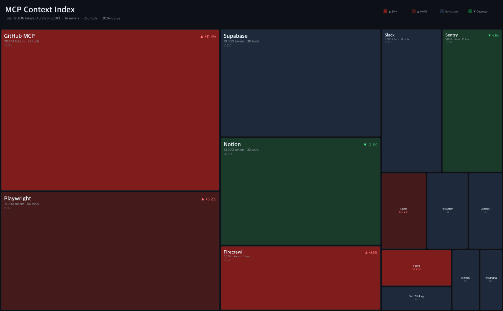

# context-treemap

Track and visualize the context window cost of MCP servers and coding agents.

Your 200K context window isn't as big as you think. Before you type a single message, system prompts, built-in tools, MCP servers, and buffers have already consumed a significant portion.

**context-treemap** tracks how much each component costs and visualizes it as a treemap — updated weekly, with version-by-version change tracking like a stock ticker.

## Latest Snapshot

### MCP Context Index

> How much context do popular MCP servers consume?



### Claude Code — Full Context (200K)

> System prompt + tools + MCP + buffers — what's left for your conversation?


### Codex — Full Context (200K)


## What's Tracked

### MCP Servers (agent-agnostic)

Tool schema token costs — the same regardless of which coding agent you use.

| Server | Tools | Tokens | % of 200K |
|--------|-------|--------|-----------|
| GitHub | 84 | 20,444 | 10.2% |
| Playwright | 56 | ~15,000 | 7.5% |
| Supabase | 30 | ~10,000 | 5.0% |
| Notion | 22 | ~10,000 | 5.0% |
| *[14 more...](config/servers.json)* | | | |

### Agent System Overhead

| Agent | System Prompt | Tools | Buffer | Total |
|-------|--------------|-------|--------|-------|
| Claude Code | 3,000 | 16,821 | 41,000 | 60,821 (30.4%) |
| Codex | 2,500 | 8,000 | 8,000 | 18,500 (9.3%) |

## How It Works

1. **Crawl**: GitHub Actions installs each MCP server's npm package weekly and extracts tool schemas
2. **Measure**: Token counts via [Anthropic's count_tokens API](https://docs.anthropic.com/en/docs/build-with-claude/token-counting) (free, accurate)
3. **Render**: D3.js treemap + node-canvas generates PNG images
4. **Track**: Version history is committed to `data/`, enabling change detection (▲▼%)

## Usage

```bash
# Install
npm install

# Crawl MCP servers and count tokens
ANTHROPIC_API_KEY=sk-... npm run crawl

# Generate treemap images
npm run render

# Both at once
npm run update
```

## Data Sources

- **MCP tool schemas**: Extracted from npm packages at runtime
- **Token counts**: [Anthropic count_tokens API](https://docs.anthropic.com/en/docs/build-with-claude/token-counting)
- **Claude Code internals**: [Piebald-AI/claude-code-system-prompts](https://github.com/Piebald-AI/claude-code-system-prompts)
- **Community reports**: [SEP-1576](https://github.com/modelcontextprotocol/modelcontextprotocol/issues/1576), [MCP Tax analysis](https://www.mmntm.net/articles/mcp-context-tax)

## Contributing

- **Add an MCP server**: Edit `config/servers.json` and submit a PR
- **Update agent data**: Edit `data/agents/*.json` with verified measurements
- **Report inaccuracies**: Open an issue with `/context` command output

## License

MIT
