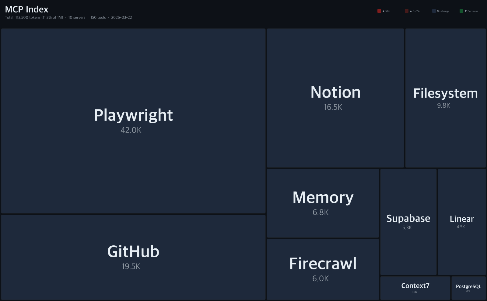
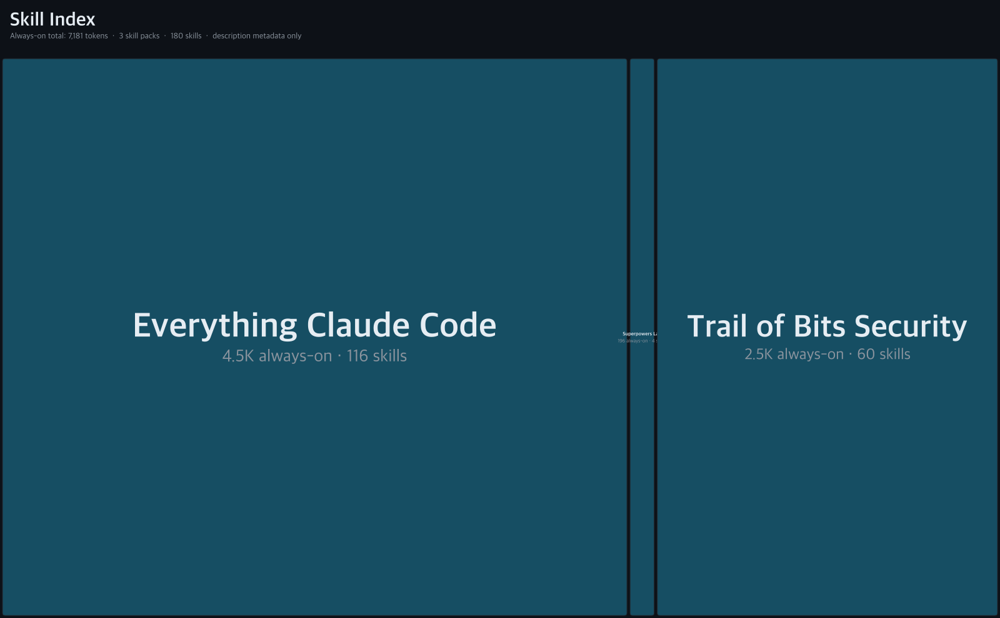
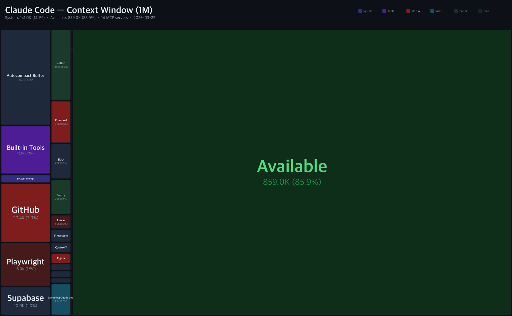
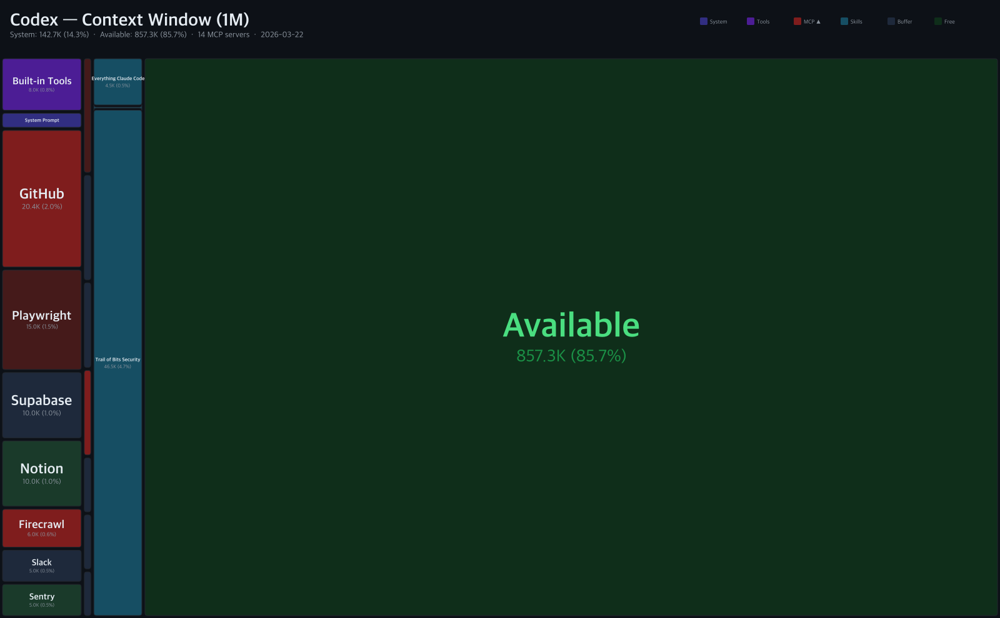

# context-treemap

[English](../README.md) | [한국어](README.ko.md) | [日本語](README.ja.md)

追踪并可视化 MCP 服务器、技能包和编码代理的上下文窗口成本。

1M 的上下文窗口并非无限。在你输入第一条消息之前，系统提示、内置工具、MCP 服务器和技能已经占用了相当一部分空间。

**context-treemap** 追踪每个组件的成本并以 treemap 形式可视化，每天自动更新，像股票行情一样追踪版本变化。

## 最新快照

### MCP Index

> 工具 schema 的 token 成本，与使用哪个编码代理无关。



### Skill Index

> 技能包的两种成本区域可视化：**深色** = always-on 成本（描述元数据，安装即加载），**浅色** = on-invoke 成本（正文，仅在调用时加载）。分隔线显示"使用前免费"的区域。



### Claude Code 上下文窗口 (1M)

> 系统 + 工具 + MCP + 技能 — 对话还剩多少空间？



### Codex 上下文窗口 (1M)



## 追踪对象

### MCP 服务器（与代理无关）

| 服务器 | 工具数 | Token | 占 1M % |
|--------|-------|-------|---------|
| GitHub | 84 | 20,444 | 2.0% |
| Playwright | 56 | ~15,000 | 1.5% |
| Supabase | 30 | ~10,000 | 1.0% |
| Notion | 22 | ~10,000 | 1.0% |
| 其他10个 | | | |
| **合计** | **263** | **~81K** | **8.1%** |

### 技能包 (Claude Code)

技能有两层成本：
- **Always-on**（描述元数据）：安装即加载到系统上下文
- **On invoke**（SKILL.md 正文）：仅在调用时加载

| 技能包 | 技能数 | Always-on | On Invoke |
|--------|-------|-----------|-----------|
| Everything Claude Code | 116 | 4,515 | ~143K |
| Trail of Bits Security | 60 | 2,470 | ~82K |
| Superpowers Lab | 4 | 196 | ~6K |

### 代理系统开销

| 代理 | 模型 | 上下文 | 系统提示 | 内置工具 | Autocompact 缓冲 | 合计 |
|------|------|--------|---------|---------|-----------------|------|
| Claude Code | Opus 4.6 | 1M | 3,000 | 16,821 | 33,000 | 52,821 (5.3%) |
| Codex | GPT-5.4 | 1M | 2,500 | 8,000 | - | 10,500 (1.1%) |

## 工作原理

1. **爬取**：GitHub Actions 每天从 MCP 服务器的 npm 包中提取工具 schema
2. **技能爬取**：从 GitHub 仓库获取 SKILL.md 文件并解析描述元数据
3. **测量**：通过 [Anthropic count_tokens API](https://docs.anthropic.com/en/docs/build-with-claude/token-counting) 精确计算 token 数（免费）
4. **渲染**：D3.js treemap + node-canvas 生成 4 张 PNG 图片
5. **追踪**：版本历史提交到 `data/`，实现变化检测（▲▼%）

每天 09:00 KST 通过 GitHub Actions 自动生成。

## 使用方法

```bash
npm install
npm run update    # 爬取 + 渲染一键执行
```

## 贡献

- **添加 MCP 服务器**：编辑 [`config/servers.json`](../config/servers.json) 并提交 PR
- **添加技能包**：编辑 [`config/skills.json`](../config/skills.json) 并提交 PR
- **更新代理数据**：编辑 `data/agents/*.json`
- **报告不准确**：提交 Issue 并附上 `/context` 命令输出

## 许可证

MIT
